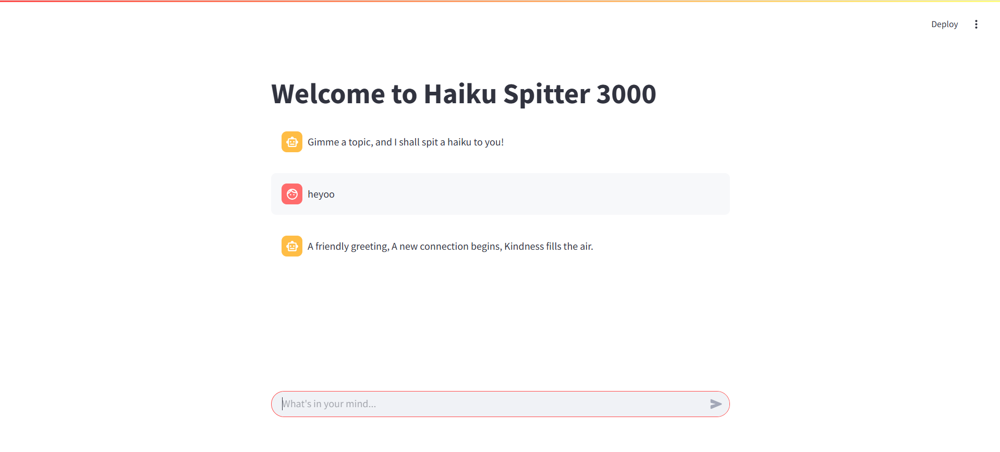

# example-ai-repo

An example of a repository to demonstrate the use of Github projects (and Poetry as a package manager).

## How to run

First, you must install poetry. Use [this guide](https://python-poetry.org/docs/#installing-with-pipx) to help you install poetry in your machine.

Then, move to the project's root folder (where the .toml file is located) and type:

```sh
poetry install
```

This will automatically setup a virtual environment for you and download the required dependencies of this project.

After that, simply execute the shell script `start_ui.sh` to launch a prototype UI for the AI Haiku poet.

_In Git Bash,_

```sh
./start_ui.sh
```

_In PowerShell,_

```sh
bash ./start_ui.sh
```

This starts a local streamlit server.



To exit, click **CTRL+C** in your shell.
